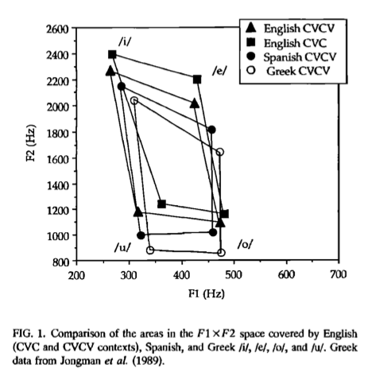

**Author**: Juan Garrido  
**Date**: Last update: `r Sys.time()`


# Overview

<!-- 
  Talk brielfy about what you did here 
  Describe your hypotheses
-->

**Description of the assignment**

In this programmaing assignment, we manipulated production data of 6 participants (3 English learners of Spanish and 3 Spanish-English bilinguals). First, we ran scripts on Praat to normalize the scale peak intensity and to create textgrids for each '.wav' file of the production data. In each textgrid, we annotated the location of the stop burst/release, the onset of voicing, and the beginning and end of the first vowel. Then, we ran a script on Praat that read in all the '.wav' files and textgrids for one participant, extracted values (f1, f2, vot, notes) of all the files using a loop, and created a '.csv' file with the data. We had to run this script for every participant creating one '.csv' file for each participant. Next, we had to read all the '.csv' files into R, manipulate the data as necessary, run descriptive stats, create plots, and embed an image from the production data. We also had to create a hypothesis and use the plots and stats to test our hypothesis.

**Hypothesis**

Based on the results reported by Bradlow (1995), I hypothesize that the native speakers of English exhibit different F1 and F2 values than the Spanish-English bilinguals for the vowel /u/. Bradlow (1995) reported differences in F1 and F2 values for vowels in Spanish and English (See image below for an example). In the image below, we can see that the Spanish /u/ is located at different F1 and F2 values than the English /u/. I expect to find higher F1 and F2 values for the English natives than for the Spanish-English bilinguals assuming that the natives will have influence from English, and therefore not show native Spanish values. 


{width=40%, height=40%}


# Prep

## Libraries

**I loaded the libraries here**

```{r, 'load-libs', echo=T, warning=F, message=F}
# Load libraries here
library(tidyverse)
library(knitr)
```


## Load data

**I loaded the '.csv' files and put them together in one data frame, which I called 'df'**

```{r, 'load-data'}
# You need to get all the files in the 'data' directory and combine them
# Check previous examples we did in class (hint: the day we did the ax 
# experiment) or search for examples of stackoverflow.com
bi01 <- read_csv("../data/bi01.csv")
bi02 <- read_csv("../data/bi02.csv")
bi03 <- read_csv("../data/bi03.csv")
ne01 <- read_csv("../data/ne01.csv")
ne02 <- read_csv("../data/ne02.csv")
ne03 <- read_csv("../data/ne03.csv")

df = bind_rows(bi01, bi02, bi03, ne01, ne02, ne03)    
```

## Tidy data

**I manipulated the data as necessary. I separated the columns so that I can have group, id, word, and trial in separate columns**

```{r, 'tidy-data'}
# Convert from long to wide or wide to long format as necessary (check 
# examples from class)
# Create any other relevant variables here 
df = separate(data = df, col = fileID, into = c("id", "word"), sep = "_")
df = separate(data = df, col = word, into = c("word", "trial"), sep = "(?<=[A-Za-z])(?=[0-9])", extra = "drop", fill = "right")
df = separate(data = df, col = id, into = c("group", "id"), sep = "(?<=[A-Za-z])(?=[0-9])")
glimpse(df)
```

# Analysis

## Descriptives

**I ran descriptive statistics. I calculated means and SD per group and word, per group, mean VOT per group, and mean F1 and F2 for all the words that had /u/ as the first vowel per group (relevant for my hypothesis)**

```{r, 'descriptive-stats'}
# Give some descriptive summaries of your data 
# Display your descriptives in a table
df %>%
  group_by(group, word) %>%
  summarise(mean_f1 = mean(f1), sd_f1 = sd(f1), mean_f2 = mean(f2), sd_f2 = sd(f2), mean_vot = mean(vot), sd_vot = sd(vot), n = n())
```

```{r, 'descriptive-stats2'}
means = df %>%
  group_by(group) %>%
  summarise(mean_f1 = mean(f1), sd_f1 = sd(f1), mean_f2 = mean(f2), sd_f2 = sd(f2), mean_vot = mean(vot), sd_vot = sd(vot), n = n())
kable(means, caption = "**Means and SD per group**")
```

```{r, 'descriptive-stats3'}
table <- df %>%
  group_by(group) %>%
  summarise(mean_vot = mean(vot), sd_vot = sd(vot), n = n())
kable(table, caption = "**Mean VOT per group**")
```

```{r}
#table1 <- df %>%
#  group_by(group, word) %>%
#  summarise(mean_vot = mean(vot), sd_vot = sd(vot))
#kable(table1, caption = "Mean VOT for word and group")
```

```{r}
table_a = df %>%
  group_by(group) %>%
  filter(word == "kuku" | word == "puku" | word == "tuku") %>%
  summarise(mean_f1 = mean(f1), sd_f1 = sd(f1), mean_f2 = mean(f2), sd_f2 = sd(f2), n = n())
kable(table_a, caption = "**Mean F1 and F2 for /u/ per group**")
```

## Visualization

**I created some plots here. Plots number 1 and number 2 represent VOT and plots 3, 4, 5, and 6 represent F1 and F2 of the vowel /u/ (relevant for my hypothesis)**

```{r, 'plot1', fig.retina=2}
ggplot(df, aes(x=group, y=vot)) +
  geom_segment( aes(x=group, xend=group, y=0, yend=vot)) +
  geom_point( size=5, color="red", fill=alpha("orange", 0.2), alpha=0.4, shape=21, stroke=3) +
  labs(title = "VOT as a function of group", y = "VOT", x = "Group")
```


```{r, 'plot2', fig.retina=2}
plot1 = filter(df, word == "taka" | word == "teke" | word == "tiki" | word == "toko" | word == "tuku")
ggplot(data = plot1, aes(x=word, y=vot, color=group)) + 
  geom_point(size=3) +
  labs(title = "VOT of /t/ as a function of vowel type and group", y = "VOT", x = "Vowel type")
```


```{r, 'plot3', fig.retina=2}
# Include some plots here
plot = filter(df, word == "kuku" | word == "puku" | word == "tuku")
ggplot(plot, aes(x=word, y=f2, fill=group)) + 
    geom_boxplot()+
  facet_wrap(~group)+
  labs(title = "F2 of /u/ as a function of stop type and group", y = "F2", x = "Stop type /p/ /t/ /k/")
```


```{r, 'plot4', fig.retina=6}
plot = filter(df, word == "kuku" | word == "puku" | word == "tuku")
ggplot(plot, aes(x=group, y=f1, fill=group)) + 
    geom_boxplot()+
  labs(title = "F1 of /u/ per group", y = "F1", x = "Group")
```

```{r, 'plot5', fig.retina = 2}
plot = filter(df, word == "kuku" | word == "puku" | word == "tuku")
ggplot(plot, aes(x=group, y=f2, fill=group)) + 
    geom_boxplot()+
  labs(title = "F2 of /u/ per group", y = "F2", x = "Group")
```

```{r, 'plot6', fig.retina = 2}
plot = filter(df, word == "kuku" | word == "puku" | word == "tuku")
ggplot(plot, aes(x=f2, y=f1, color = group, shape = group)) + 
    geom_point(size=3, alpha=0.7)+
  labs(title = "F1 and F2 of /u/ per group", y = "F1", x = "F2")
```

**Below I am including an image that represents F1 and F2 of /u/ in the first syllable of /kuku/ of a Spanish-English bilingual**

{width=30%, height=35%}


**Below I am including an image that represents F1 and F2 of /u/ in the first syllable of /kuku/ of a native English speaker**

{width=30%, height=35%}


<!-- 
Include a professional looking figure illustrating an example of the acoustics 
of the production data.
You decide what is relevant (something related to your hypothesis). 
Think about where this word should be located in your project. 
What location makes most sense in terms of organization? 
How will you access the word (path) from this .Rmd word?
If you need help consider the following sources: 
  - Search 'Rmarkdown image' on google, stackoverflow, etc.
  - Search the 'knitr' package help words in RStudio
  - Search the internet for HTML code (not recommended, but it works)
  - Check the code from my class presentations (may or may not be helpful)
-->

## Hypothesis test

**As I mentioned above, I hypothesized that the native speakers of English exhibit different F1 and F2 values than the Spanish-English bilinguals for the vowel /u/. In order to test this hypothesis, I conducted independent samples T-tests for f1 and f2 for both groups.**

First, I calculated all the means and SD necessary.

```{r, 'means for stats'}
# Conduct a simple statistical analysis here (optional)
t = df %>%
  group_by(group) %>%
  filter(word == "kuku" | word == "puku" | word == "tuku") %>%
  summarise(mean_f1 = mean(f1), sd_f1 = sd(f1), mean_f2 = mean(f2), sd_f2 = sd(f2), n = n())
kable(t, caption = "**Mean F1 and F2 for /u/ per group**")
```

Then, I ran the T-test for F1 for both groups.

```{r, 't test for F1'}
set.seed(0)

bi_f1 <- rnorm(27, mean = 449.1107, sd = 92.43818)
ne_f1 <- rnorm(27, mean = 534.5293, sd = 198.11902)

t.test(bi_f1, ne_f1, var.equal = TRUE)
```

Next, I ran the T-test for F2 for both groups.

```{r, 't test for F2'}
set.seed(0)

bi_f2 <- rnorm(27, mean = 960.4133, sd = 276.8831)
ne_f2 <- rnorm(27, mean = 1171.5711, sd = 244.4849)

t.test(bi_f2, ne_f2, var.equal = TRUE)
```


# Conclusion

<!-- 
Revisit your hypotheses (refer to plots, figures, tables, statistical tests, 
etc.)

Reflect on the entire process. 
What did you enjoy? What did you hate? What did you learn? 
What would you do differently?
-->
**Discussion of hypothesis and results**

Based on the results reported by Bradlow (1995), I hypothesized that English learners of Spanish exhibit different F1 and F2 values than Spanish-English bilinguals for the vowel /u/. Bradlow (1995) reported that the Spanish /u/ was located at lower F1 and F2 values than the English /u/. I expected to observe higher F1 and F2 values for the English natives than for the Spanish-English bilinguals assuming that the English natives would have influence from English, and therefore not show native Spanish values.
In order to test the hypothesis, I ran two independent samples T-Tests (for F1 and F2) including both groups of participants. Results revealed a significant difference for the F2 values of bilinguals and monolinguals (p-value = 0.0083); however, there was no significant difference for F1 values (p-value = 0.06626). As established in my hypothesis, bilinguals and monolinguals differed in F1 values (bilinguals *M* = 449.1107, *SD* = 92.43818; monolinguals *M* = 534.5293, *SD* = 198.11902) and F2 values (bilinguals *M* = 960.4133, *SD* = 276.8831; monolinguals *M* = 1171.5711, *SD* = 244.4849), but only the difference in F2 was significant. Native speakers of English exhibited higher values than bilinguals, as I predicted, indicating different points of articulation for /u/ in these groups. These results coincide with those reported in the vowel space comparison by Bradlow (1995). 
Plot 3, plot 4, plot 5, and plot 6 above show F1 and F2 for both groups and we can see that the natives exhibited higher values. 

**Reflection**

This programming assignment was definitely more challenging than previous ones because it required us to employ different skills that we learned throughout the semester. I really enjoyed manipulating the data and creating the plots. Although it may be stressful to find the right combinations of codes, it gives me a feeling of satisfaction and relief when I see that the code finally runs as expected. It is amazing to see the kinds of plots that can be created in this program! I struggled a little to come up with a hypothesis and to figure out what statistical analysis to run. This assignment has definitely made me less afraid of manipulating and analyzing data in R and I can say that I felt comfortable and had fun doing it. 

</br></br>
